<!-- ═══════════════════════ ANIMATED HEADER ═══════════════════════ -->
<div align="center">


<a href="https://github.com/ashrithBalaji456/Knowledge_Library">
  
</a>

<br/>


</div>

---

## 📑 Table of Contents

- [✨ Overview](#-overview)
- [🎯 Key Features](#-key-features)
- [🧰 Tech Stack](#-tech-stack)
- [🏗️ System Architecture](#️-system-architecture)
- [🔄 Workflow Charts](#-workflow-charts)
- [📊 Data Charts](#-data-charts)
- [🗂️ Project Structure](#️-project-structure)
- [🚀 Getting Started](#-getting-started)
- [📜 Available Scripts](#-available-scripts)
- [🧪 Linting & Code Quality](#-linting--code-quality)
- [🗺️ Roadmap](#️-roadmap)
- [🤝 Contributing](#-contributing)
- [👤 Author](#-author)

---

## ✨ Overview

**Knowledge Library 3D** (`3d-library`) is a web application that turns a personal collection of documents into an **interactive 3D library**. Instead of a flat list of files, your knowledge lives on virtual shelves that you can orbit, zoom, and explore in real time.

It is built on a modern front-end stack: **React 19** for the UI, **React Three Fiber + Drei** for declarative 3D rendering, **Zustand** for lightweight global state, **PDF.js** for reading PDFs in the browser, and **JSZip** for handling bundled/archived content. Styling is handled by **Tailwind CSS 4**, and the whole project is bundled with **Vite 8** and written in **TypeScript**.

> 📝 **Note:** This README was generated from the repository's `package.json`, `index.html`, and configuration files. Where a section describes behaviour (features, flows, roadmap), it reflects what the dependency stack is designed to do. Adjust the wording to match your exact implementation in `src/`.

---

## 🎯 Key Features

| | Feature | Description |
|---|---|---|
| 🧊 | **Immersive 3D Library** | Navigate shelves and books with orbit / zoom / pan controls powered by Three.js. |
| 📄 | **In-Browser PDF Reading** | Parse and render PDF pages client-side with `pdfjs-dist`, no server required. |
| 🗜️ | **ZIP Import / Export** | Bundle or unpack collections using `jszip`. |
| 🧠 | **Global State Store** | Fast, minimal state management with `zustand`. |
| 🎨 | **Modern UI** | Tailwind CSS 4 + Lucide icons + Inter / Outfit / JetBrains Mono typography. |
| ⚡ | **Instant Feedback** | Vite HMR for near-instant updates during development. |
| 🔒 | **Type Safe** | End-to-end TypeScript with strict project references. |
| 🧹 | **Fast Linting** | Oxlint for lightning-quick static analysis. |

---

## 🧰 Tech Stack

<div align="center">


</div>

| Layer | Technology | Version | Purpose |
|---|---|---|---|
| **UI Framework** | React | ^19.2 | Component-based UI |
| **Language** | TypeScript | ~6.0 | Static typing |
| **Build Tool** | Vite | ^8.3 | Dev server & bundler |
| **3D Engine** | Three.js | ^0.186 | WebGL rendering |
| **3D Bindings** | @react-three/fiber | ^9.8 | React renderer for Three.js |
| **3D Helpers** | @react-three/drei | ^10.7 | Controls, loaders, abstractions |
| **State** | Zustand | ^5.0 | Global store |
| **Styling** | Tailwind CSS + `@tailwindcss/vite` | ^4.3 | Utility-first CSS |
| **PDF Engine** | pdfjs-dist | ^6.3 | PDF parsing / rendering |
| **Archives** | JSZip | ^3.10 | ZIP read / write |
| **Icons** | lucide-react | ^1.48 | Icon set |
| **Linter** | Oxlint | ^1.81 | Static analysis |

---

## 🏗️ System Architecture

High-level view of how the layers of the application fit together.

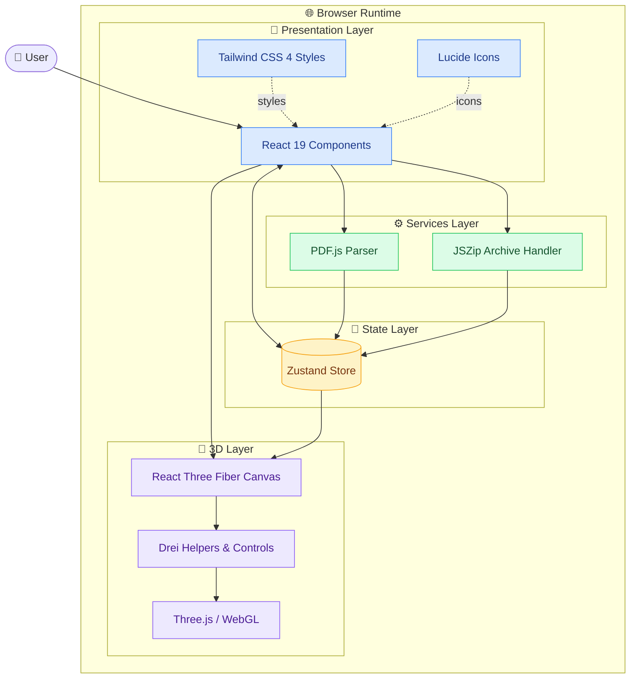
```mermaid
flowchart TB
    subgraph Browser["🌐 Browser Runtime"]
        direction TB

        subgraph UI["🎨 Presentation Layer"]
            A1["React 19 Components"]
            A2["Tailwind CSS 4 Styles"]
            A3["Lucide Icons"]
        end

        subgraph ThreeD["🧊 3D Layer"]
            B1["React Three Fiber Canvas"]
            B2["Drei Helpers & Controls"]
            B3["Three.js / WebGL"]
        end

        subgraph State["🧠 State Layer"]
            C1[("Zustand Store")]
        end

        subgraph Services["⚙️ Services Layer"]
            D1["PDF.js Parser"]
            D2["JSZip Archive Handler"]
        end
    end

    User(["👤 User"]) --> A1
    A1 <--> C1
    A1 --> B1
    B1 --> B2 --> B3
    C1 --> B1
    A1 --> D1
    A1 --> D2
    D1 --> C1
    D2 --> C1
    A2 -.styles.-> A1
    A3 -.icons.-> A1

    classDef ui fill:#dbeafe,stroke:#3b82f6,color:#1e3a8a
    classDef td fill:#ede9fe,stroke:#8b5cf6,color:#4c1d95
    classDef st fill:#fef3c7,stroke:#f59e0b,color:#78350f
    classDef sv fill:#dcfce7,stroke:#22c55e,color:#14532d
    class A1,A2,A3 ui
    class B1,B2,B3 td
    class C1 st
    class D1,D2 sv
```

### 🧩 Component Relationship (Class Diagram)

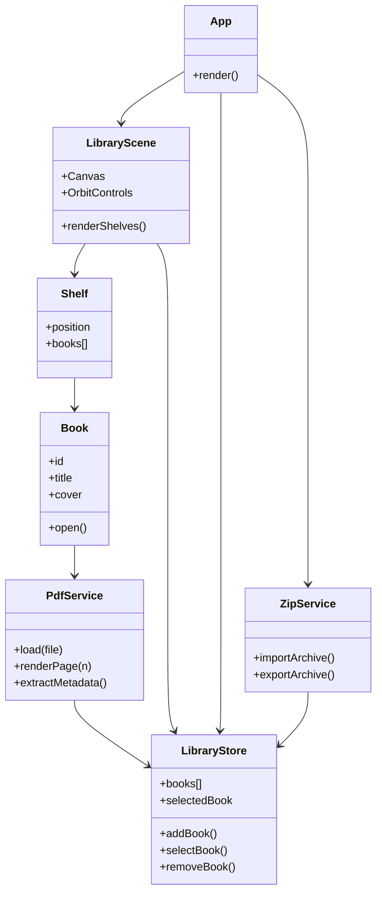
```mermaid
classDiagram
    class App {
        +render()
    }
    class LibraryScene {
        +Canvas
        +OrbitControls
        +renderShelves()
    }
    class Shelf {
        +position
        +books[]
    }
    class Book {
        +id
        +title
        +cover
        +open()
    }
    class LibraryStore {
        +books[]
        +selectedBook
        +addBook()
        +selectBook()
        +removeBook()
    }
    class PdfService {
        +load(file)
        +renderPage(n)
        +extractMetadata()
    }
    class ZipService {
        +importArchive()
        +exportArchive()
    }

    App --> LibraryScene
    LibraryScene --> Shelf
    Shelf --> Book
    App --> LibraryStore
    LibraryScene --> LibraryStore
    Book --> PdfService
    App --> ZipService
    ZipService --> LibraryStore
    PdfService --> LibraryStore
```

---

## 🔄 Workflow Charts

### 1️⃣ End-to-End User Workflow

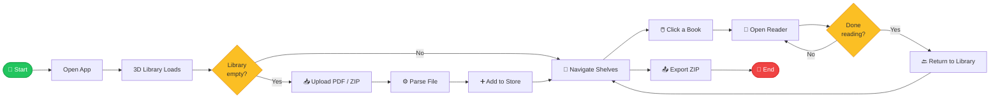
```mermaid
flowchart LR
    S([🚀 Start]) --> L[Open App]
    L --> V[3D Library Loads]
    V --> Q{Library<br/>empty?}
    Q -- Yes --> U[📥 Upload PDF / ZIP]
    Q -- No --> N[🧭 Navigate Shelves]
    U --> P[⚙️ Parse File]
    P --> A[➕ Add to Store]
    A --> N
    N --> C[🖱️ Click a Book]
    C --> O[📖 Open Reader]
    O --> R{Done<br/>reading?}
    R -- No --> O
    R -- Yes --> B[🔙 Return to Library]
    B --> N
    N --> E[📤 Export ZIP]
    E --> F([🏁 End])

    style S fill:#22c55e,color:#fff,stroke:#16a34a
    style F fill:#ef4444,color:#fff,stroke:#dc2626
    style Q fill:#fbbf24,stroke:#d97706
    style R fill:#fbbf24,stroke:#d97706
```

### 2️⃣ File Upload & Processing Sequence

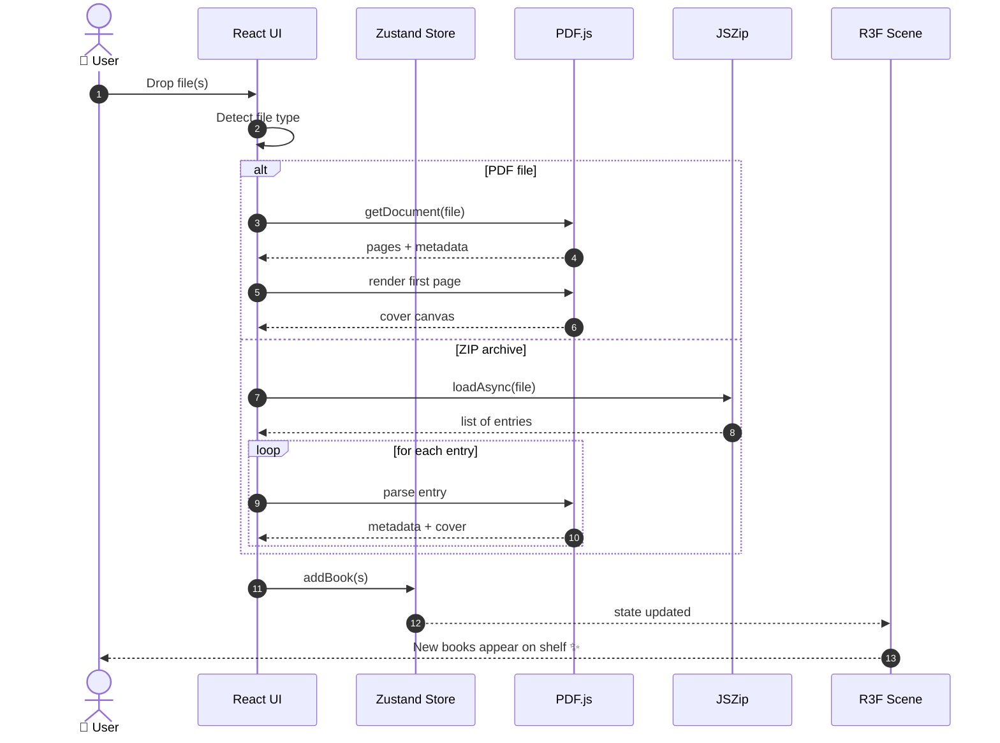
```mermaid
sequenceDiagram
    autonumber
    actor U as 👤 User
    participant UI as React UI
    participant ST as Zustand Store
    participant PDF as PDF.js
    participant ZIP as JSZip
    participant 3D as R3F Scene

    U->>UI: Drop file(s)
    UI->>UI: Detect file type
    alt PDF file
        UI->>PDF: getDocument(file)
        PDF-->>UI: pages + metadata
        UI->>PDF: render first page
        PDF-->>UI: cover canvas
    else ZIP archive
        UI->>ZIP: loadAsync(file)
        ZIP-->>UI: list of entries
        loop for each entry
            UI->>PDF: parse entry
            PDF-->>UI: metadata + cover
        end
    end
    UI->>ST: addBook(s)
    ST-->>3D: state updated
    3D-->>U: New books appear on shelf ✨
```

### 3️⃣ Book Interaction State Machine

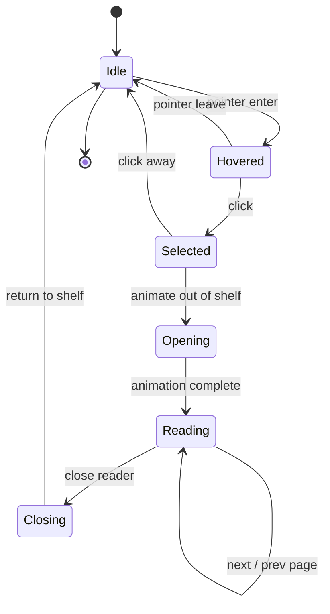
```mermaid
stateDiagram-v2
    [*] --> Idle
    Idle --> Hovered: pointer enter
    Hovered --> Idle: pointer leave
    Hovered --> Selected: click
    Selected --> Opening: animate out of shelf
    Opening --> Reading: animation complete
    Reading --> Reading: next / prev page
    Reading --> Closing: close reader
    Closing --> Idle: return to shelf
    Selected --> Idle: click away
    Idle --> [*]
```

### 4️⃣ Development & Build Pipeline

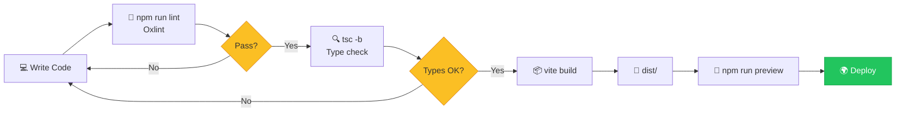
```mermaid
flowchart LR
    A[💻 Write Code] --> B[🧹 npm run lint<br/>Oxlint]
    B --> C{Pass?}
    C -- No --> A
    C -- Yes --> D[🔍 tsc -b<br/>Type check]
    D --> E{Types OK?}
    E -- No --> A
    E -- Yes --> F[📦 vite build]
    F --> G[📁 dist/]
    G --> H[👀 npm run preview]
    H --> I[🌍 Deploy]

    style C fill:#fbbf24,stroke:#d97706
    style E fill:#fbbf24,stroke:#d97706
    style I fill:#22c55e,color:#fff,stroke:#16a34a
```

### 5️⃣ Git Branching Workflow

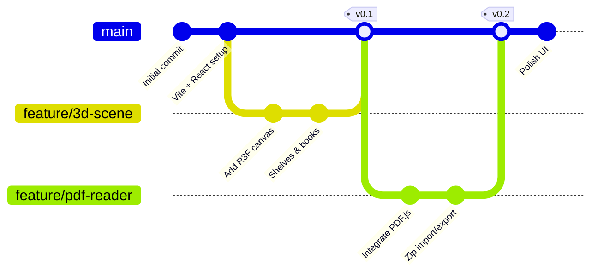
```mermaid
gitGraph
    commit id: "Initial commit"
    commit id: "Vite + React setup"
    branch feature/3d-scene
    checkout feature/3d-scene
    commit id: "Add R3F canvas"
    commit id: "Shelves & books"
    checkout main
    merge feature/3d-scene tag: "v0.1"
    branch feature/pdf-reader
    checkout feature/pdf-reader
    commit id: "Integrate PDF.js"
    commit id: "Zip import/export"
    checkout main
    merge feature/pdf-reader tag: "v0.2"
    commit id: "Polish UI"
```

### 6️⃣ Rendering Loop (Per Frame)

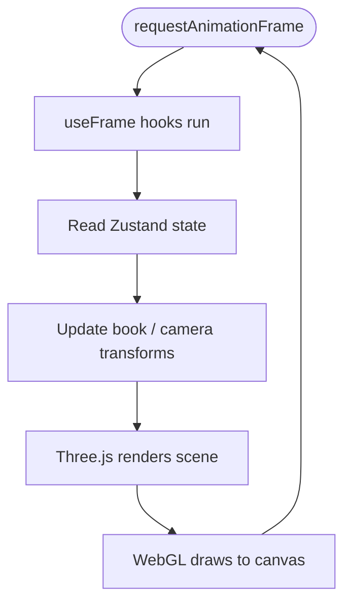
```mermaid
flowchart TD
    A([requestAnimationFrame]) --> B[useFrame hooks run]
    B --> C[Read Zustand state]
    C --> D[Update book / camera transforms]
    D --> E[Three.js renders scene]
    E --> F[WebGL draws to canvas]
    F --> A
```

### 7️⃣ User Journey

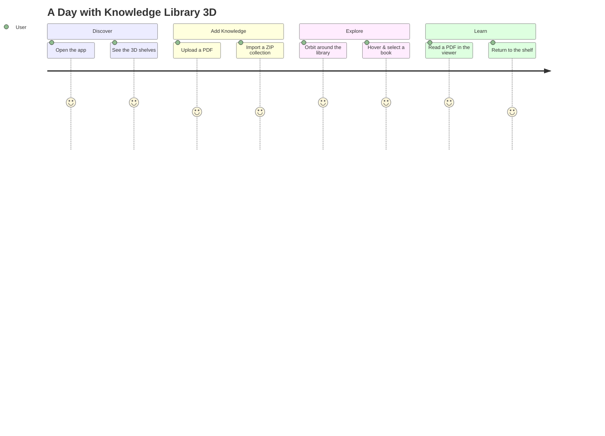
```mermaid
journey
    title A Day with Knowledge Library 3D
    section Discover
      Open the app: 5: User
      See the 3D shelves: 5: User
    section Add Knowledge
      Upload a PDF: 4: User
      Import a ZIP collection: 4: User
    section Explore
      Orbit around the library: 5: User
      Hover & select a book: 5: User
    section Learn
      Read a PDF in the viewer: 5: User
      Return to the shelf: 4: User
```

---

## 📊 Data Charts

> 📌 Charts in this section marked **(real)** are derived directly from `package.json` / repo metadata. Charts marked **(illustrative)** are templates, replace the numbers with your own measurements.

### 🥧 Dependency Breakdown by Category **(real)**

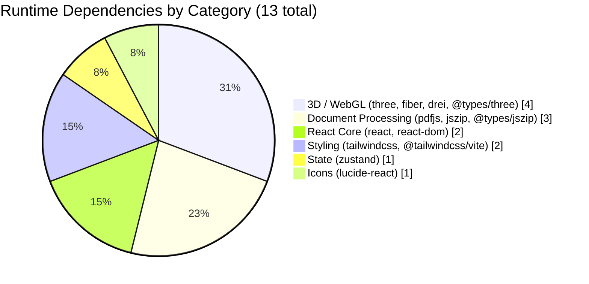
```mermaid
pie showData
    title Runtime Dependencies by Category (13 total)
    "3D / WebGL (three, fiber, drei, @types/three)" : 4
    "Document Processing (pdfjs, jszip, @types/jszip)" : 3
    "React Core (react, react-dom)" : 2
    "Styling (tailwindcss, @tailwindcss/vite)" : 2
    "State (zustand)" : 1
    "Icons (lucide-react)" : 1
```

### 🥧 Dependencies vs Dev-Dependencies **(real)**

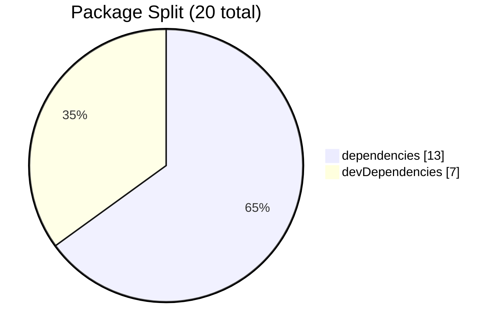
```mermaid
pie showData
    title Package Split (20 total)
    "dependencies" : 13
    "devDependencies" : 7
```

### 📊 Bundle Weight by Layer **(illustrative)**

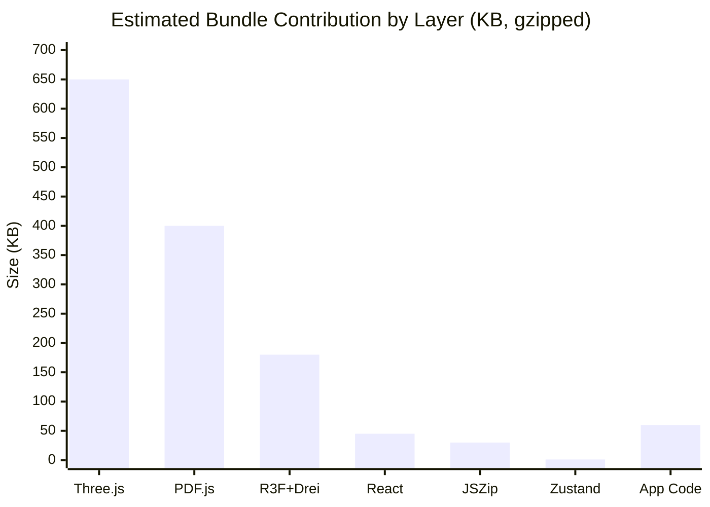
```mermaid
xychart-beta
    title "Estimated Bundle Contribution by Layer (KB, gzipped)"
    x-axis ["Three.js", "PDF.js", "R3F+Drei", "React", "JSZip", "Zustand", "App Code"]
    y-axis "Size (KB)" 0 --> 700
    bar [650, 400, 180, 45, 30, 1, 60]
```

### 📈 Development Activity **(illustrative)**

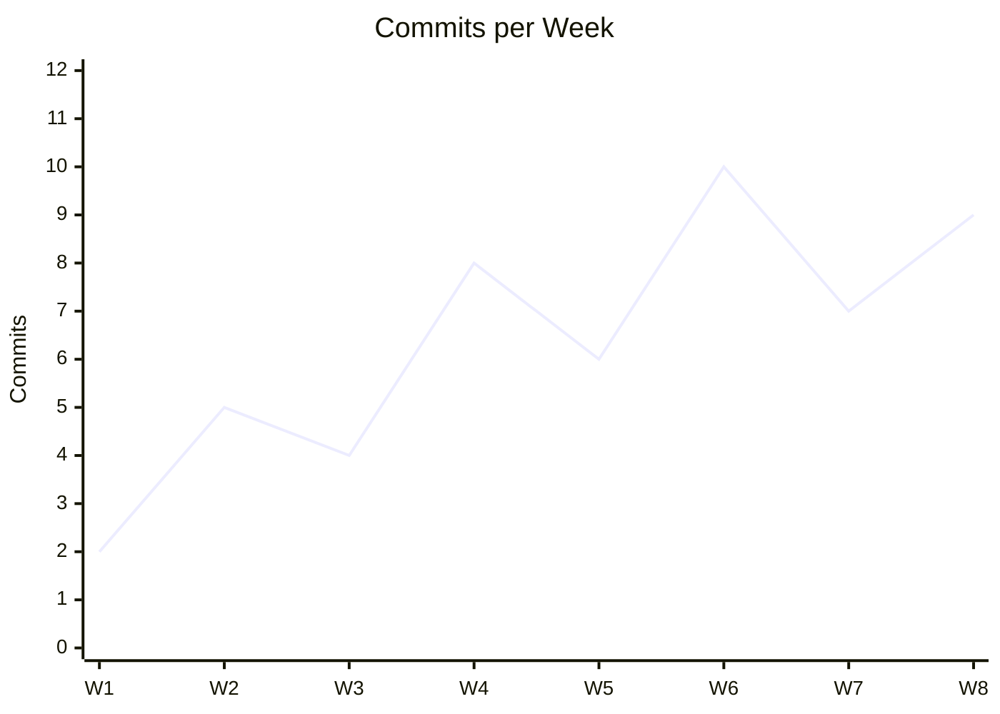
```mermaid
xychart-beta
    title "Commits per Week"
    x-axis ["W1", "W2", "W3", "W4", "W5", "W6", "W7", "W8"]
    y-axis "Commits" 0 --> 12
    line [2, 5, 4, 8, 6, 10, 7, 9]
```

### 📉 Frame-Rate Performance Targets **(illustrative)**

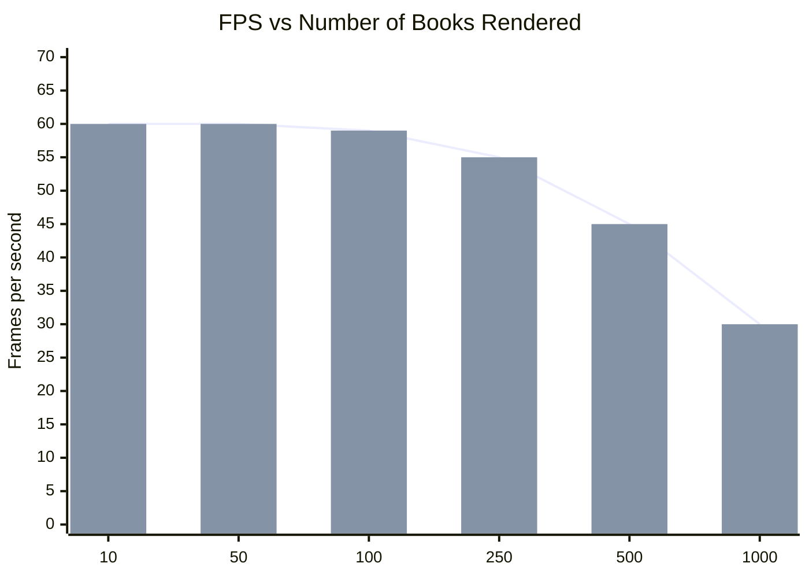
```mermaid
xychart-beta
    title "FPS vs Number of Books Rendered"
    x-axis ["10", "50", "100", "250", "500", "1000"]
    y-axis "Frames per second" 0 --> 70
    line [60, 60, 59, 55, 45, 30]
    bar [60, 60, 59, 55, 45, 30]
```

### 🎯 Feature Priority Matrix **(illustrative)**

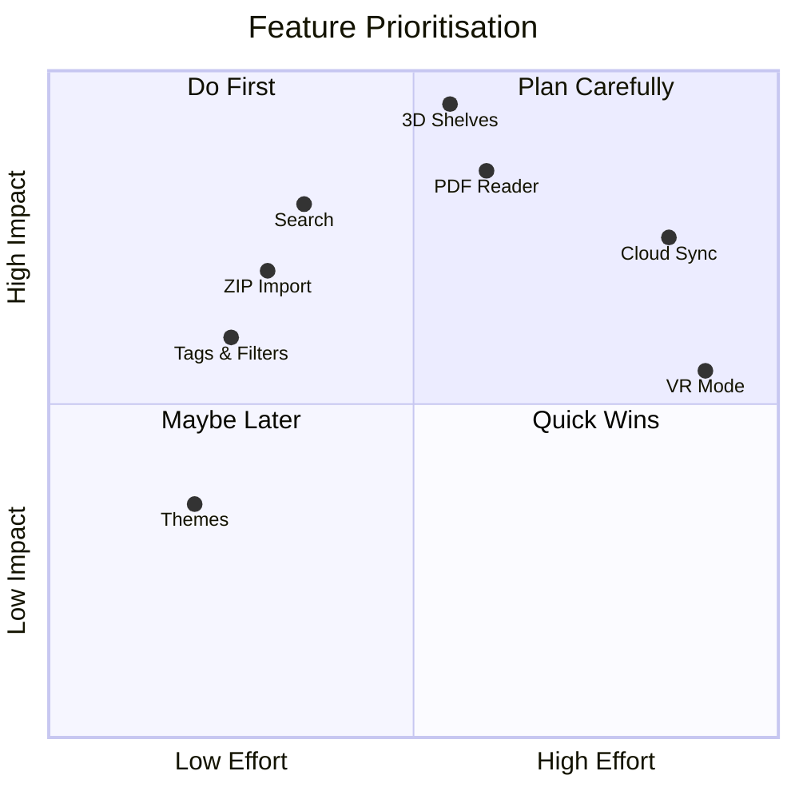
```mermaid
quadrantChart
    title Feature Prioritisation
    x-axis Low Effort --> High Effort
    y-axis Low Impact --> High Impact
    quadrant-1 Plan Carefully
    quadrant-2 Do First
    quadrant-3 Maybe Later
    quadrant-4 Quick Wins
    3D Shelves: [0.55, 0.95]
    PDF Reader: [0.6, 0.85]
    ZIP Import: [0.3, 0.7]
    Search: [0.35, 0.8]
    Tags & Filters: [0.25, 0.6]
    Themes: [0.2, 0.35]
    VR Mode: [0.9, 0.55]
    Cloud Sync: [0.85, 0.75]
```

### 🌊 Data Flow Volume (Sankey) **(illustrative)**

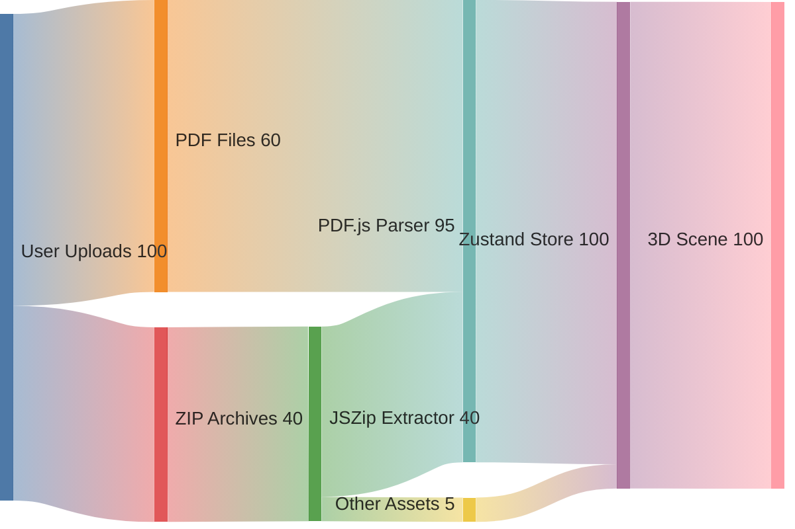
```mermaid
sankey-beta

User Uploads,PDF Files,60
User Uploads,ZIP Archives,40
PDF Files,PDF.js Parser,60
ZIP Archives,JSZip Extractor,40
JSZip Extractor,PDF.js Parser,35
JSZip Extractor,Other Assets,5
PDF.js Parser,Zustand Store,95
Other Assets,Zustand Store,5
Zustand Store,3D Scene,100
```

### 🧠 Mind Map of the Project

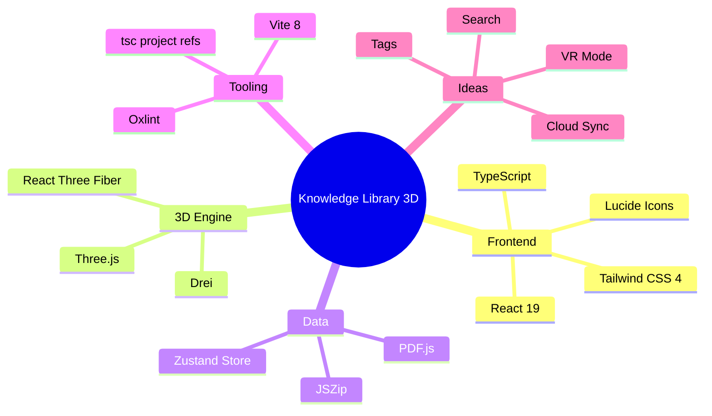
```mermaid
mindmap
  root((Knowledge Library 3D))
    Frontend
      React 19
      TypeScript
      Tailwind CSS 4
      Lucide Icons
    3D Engine
      Three.js
      React Three Fiber
      Drei
    Data
      Zustand Store
      PDF.js
      JSZip
    Tooling
      Vite 8
      Oxlint
      tsc project refs
    Ideas
      Search
      Tags
      Cloud Sync
      VR Mode
```

### 🗃️ Entity Relationship Model **(proposed data model)**

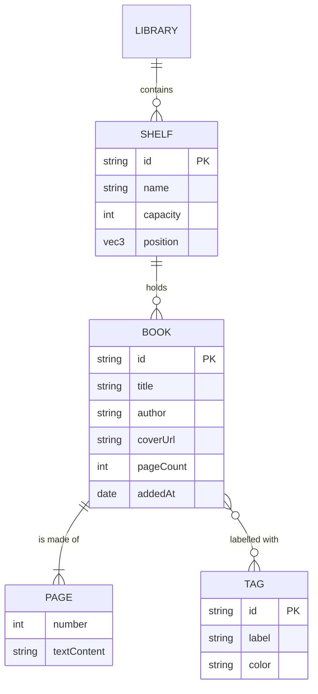
```mermaid
erDiagram
    LIBRARY ||--o{ SHELF : contains
    SHELF ||--o{ BOOK : holds
    BOOK ||--|{ PAGE : "is made of"
    BOOK }o--o{ TAG : "labelled with"
    BOOK {
        string id PK
        string title
        string author
        string coverUrl
        int pageCount
        date addedAt
    }
    SHELF {
        string id PK
        string name
        int capacity
        vec3 position
    }
    TAG {
        string id PK
        string label
        string color
    }
    PAGE {
        int number
        string textContent
    }
```

### 🗓️ Project Timeline **(illustrative)**

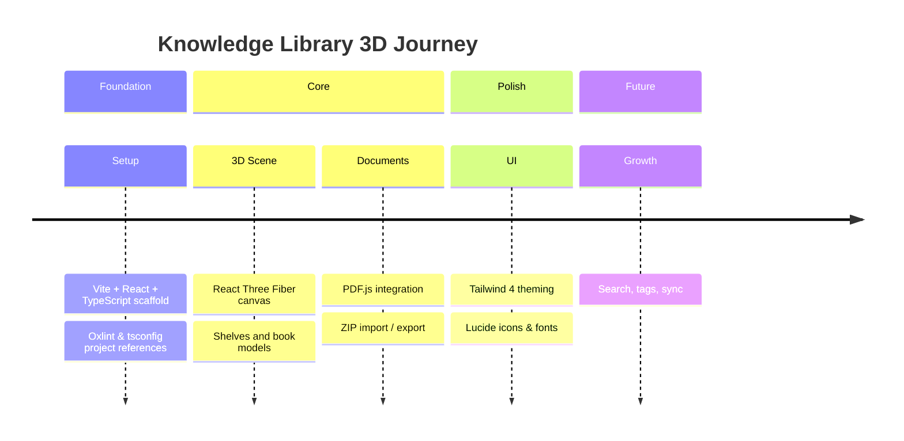
```mermaid
timeline
    title Knowledge Library 3D Journey
    section Foundation
        Setup : Vite + React + TypeScript scaffold
              : Oxlint & tsconfig project references
    section Core
        3D Scene : React Three Fiber canvas
                 : Shelves and book models
        Documents : PDF.js integration
                  : ZIP import / export
    section Polish
        UI : Tailwind 4 theming
           : Lucide icons & fonts
    section Future
        Growth : Search, tags, sync
```

### 📅 Roadmap Gantt Chart **(illustrative)**

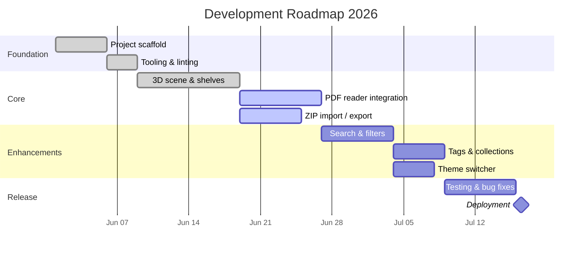
```mermaid
gantt
    title Development Roadmap 2026
    dateFormat  YYYY-MM-DD
    axisFormat  %b %d

    section Foundation
    Project scaffold           :done,    f1, 2026-06-01, 5d
    Tooling & linting          :done,    f2, after f1, 3d

    section Core
    3D scene & shelves         :done,    c1, after f2, 10d
    PDF reader integration     :active,  c2, after c1, 8d
    ZIP import / export        :active,  c3, after c1, 6d

    section Enhancements
    Search & filters           :         e1, after c2, 7d
    Tags & collections         :         e2, after e1, 5d
    Theme switcher             :         e3, after e1, 4d

    section Release
    Testing & bug fixes        :         r1, after e2, 7d
    Deployment                 :milestone, r2, after r1, 1d
```

### 🏆 Skill / Technology Radar **(illustrative)**

| Technology | Proficiency Used | Visual |
|---|:---:|---|
| React | 95% |  |
| TypeScript | 90% |  |
| Three.js / R3F | 85% |  |
| Tailwind CSS | 90% |  |
| PDF.js | 75% |  |
| Zustand | 85% |  |

### 📈 Live Repository Stats

<div align="center">


<br/>


<br/>


<br/>


</div>

---

## 🗂️ Project Structure

```text
Knowledge_Library/
├── 📁 public/              # Static assets (favicon, models, textures, etc.)
├── 📁 scripts/             # Helper / build scripts
├── 📁 src/                 # Application source code
│   └── main.tsx            # React entry point
├── 📄 index.html           # HTML shell (loads Inter, Outfit, JetBrains Mono)
├── 📄 package.json         # Dependencies & npm scripts
├── 📄 package-lock.json    # Locked dependency tree
├── 📄 vite.config.ts       # Vite configuration
├── 📄 tsconfig.json        # TS root config (project references)
├── 📄 tsconfig.app.json    # TS config for app code
├── 📄 tsconfig.node.json   # TS config for Node / tooling code
├── 📄 .oxlintrc.json       # Oxlint rules
├── 📄 .gitignore
└── 📄 README.md
```

```mermaid
graph LR
    R[Knowledge_Library] --> P[public]
    R --> S[scripts]
    R --> SRC[src]
    R --> CFG[Config Files]
    SRC --> M[main.tsx]
    CFG --> V[vite.config.ts]
    CFG --> T[tsconfig.*.json]
    CFG --> O[.oxlintrc.json]
    CFG --> PK[package.json]
```

---

## 🚀 Getting Started

### ✅ Prerequisites

- **Node.js** `>= 20` (recommended: latest LTS)
- **npm** `>= 10`
- A browser with **WebGL 2** support (Chrome, Edge, Firefox, Safari)

### 📥 Installation

```bash
# 1. Clone the repository
git clone https://github.com/ashrithBalaji456/Knowledge_Library.git

# 2. Move into the project
cd Knowledge_Library

# 3. Install dependencies
npm install

# 4. Start the dev server
npm run dev
```

Then open the URL printed in your terminal (usually **http://localhost:5173**).

### 🏭 Production Build

```bash
npm run build      # type-check + bundle into /dist
npm run preview    # serve the production build locally
```

---

## 📜 Available Scripts

| Command | What it does |
|---|---|
| `npm run dev` | Starts the Vite dev server with HMR |
| `npm run build` | Runs `tsc -b` then `vite build` |
| `npm run lint` | Runs Oxlint across the project |
| `npm run preview` | Previews the production build locally |

---

## 🧪 Linting & Code Quality

This project uses **Oxlint** for very fast linting. To enable type-aware rules for production use, install `oxlint-tsgolint` and extend `.oxlintrc.json`:

```json
{
  "$schema": "./node_modules/oxlint/configuration_schema.json",
  "plugins": ["react", "typescript", "oxc"],
  "options": {
    "typeAware": true
  },
  "rules": {
    "react/rules-of-hooks": "error",
    "react/only-export-components": ["warn", { "allowConstantExport": true }]
  }
}
```

See the [Oxlint rules documentation](https://oxc.rs/docs/guide/usage/linter/rules) for the full list.

> 💡 The **React Compiler** is not enabled by default because of its impact on dev and build performance. See the [React Compiler installation guide](https://react.dev/learn/react-compiler/installation) to add it.

---

## 🗺️ Roadmap

- [x] Project scaffold (React + TypeScript + Vite)
- [x] 3D scene foundation with React Three Fiber
- [x] PDF.js and JSZip integration
- [ ] 🔍 Full-text search across books
- [ ] 🏷️ Tags, collections & filters
- [ ] 🌗 Light / dark theme switcher
- [ ] 💾 Persistent storage (IndexedDB / localStorage)
- [ ] ☁️ Optional cloud sync
- [ ] 🥽 WebXR / VR mode
- [ ] 📱 Mobile touch gesture polish
- [ ] 🧪 Unit & E2E test suite

---

## 🤝 Contributing

Contributions, issues and feature requests are welcome!

```mermaid
flowchart LR
    A[🍴 Fork the repo] --> B[🌿 Create feature branch]
    B --> C[💻 Make changes]
    C --> D[🧹 npm run lint]
    D --> E[✅ Commit]
    E --> F[📤 Push branch]
    F --> G[🔀 Open Pull Request]
    G --> H{Review OK?}
    H -- Yes --> I[🎉 Merged!]
    H -- No --> C
```

```bash
git checkout -b feature/amazing-feature
git commit -m "feat: add amazing feature"
git push origin feature/amazing-feature
```

---

## 👤 Author

<div align="center">

**Ashrith Balaji**

[](https://github.com/ashrithBalaji456)

⭐ **If you like this project, please give it a star!** ⭐

<br/>


</div>
